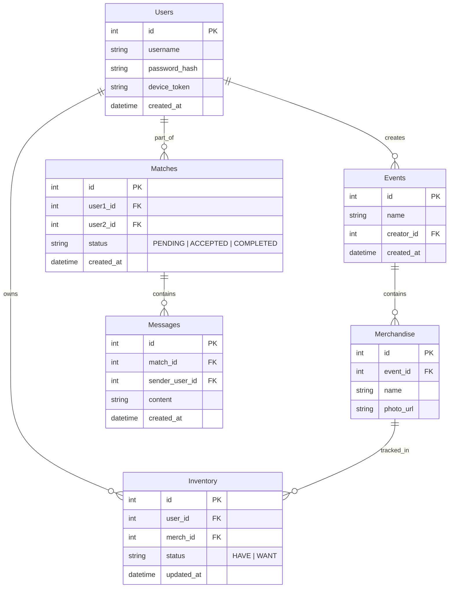

# Database Schema - ymatch

This schema is designed for **SQLite** (via SQLx).



## SQL Definitions (Draft)

```sql
CREATE TABLE users (
    id INTEGER PRIMARY KEY AUTOINCREMENT,
    username TEXT NOT NULL UNIQUE,
    password_hash TEXT NOT NULL,
    created_at DATETIME DEFAULT CURRENT_TIMESTAMP
);

CREATE TABLE inventory (
    user_id INTEGER NOT NULL,
    merch_id INTEGER NOT NULL,
    status TEXT NOT NULL CHECK(status IN ('HAVE', 'WANT')),
    PRIMARY KEY (user_id, merch_id)
);
```
