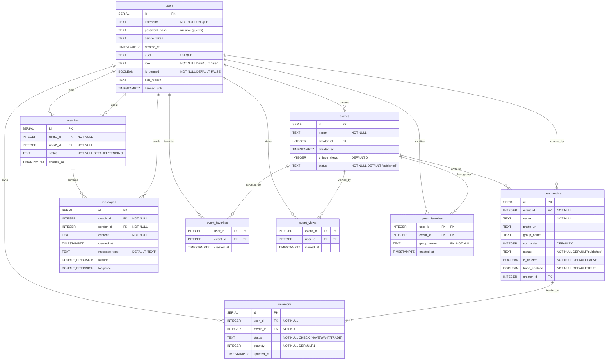

# Database Schema - ymatch

This schema is designed for **PostgreSQL** (via SQLx). The database powers the ymatch merchandise trading platform, managing users, events, merchandise catalogs, inventory tracking, match-based trading, and real-time messaging.

## Entity-Relationship Diagram



## SQL Definitions

```sql
CREATE TABLE users (
    id SERIAL PRIMARY KEY,
    username TEXT NOT NULL UNIQUE,
    password_hash TEXT,                          -- nullable for guest accounts
    device_token TEXT,
    created_at TIMESTAMPTZ DEFAULT NOW(),
    uuid TEXT UNIQUE,                            -- persistent guest identifier
    role TEXT NOT NULL DEFAULT 'user',           -- 'user', 'moderator', 'admin'
    is_banned BOOLEAN NOT NULL DEFAULT FALSE,
    ban_reason TEXT,
    banned_until TIMESTAMPTZ                     -- NULL = permanent ban when is_banned=TRUE
);

CREATE TABLE events (
    id SERIAL PRIMARY KEY,
    name TEXT NOT NULL,
    creator_id INTEGER REFERENCES users(id),
    created_at TIMESTAMPTZ DEFAULT NOW(),
    unique_views INTEGER DEFAULT 0,
    status TEXT NOT NULL DEFAULT 'published'     -- 'draft', 'published'
);

CREATE TABLE merchandise (
    id SERIAL PRIMARY KEY,
    event_id INTEGER NOT NULL REFERENCES events(id),
    name TEXT NOT NULL,
    photo_url TEXT,
    group_name TEXT,                             -- logical grouping within an event
    sort_order INTEGER DEFAULT 0,
    status TEXT NOT NULL DEFAULT 'published',    -- 'draft', 'published'
    is_deleted BOOLEAN NOT NULL DEFAULT FALSE,   -- soft-delete flag
    trade_enabled BOOLEAN NOT NULL DEFAULT TRUE,
    creator_id INTEGER REFERENCES users(id)
);

CREATE TABLE inventory (
    id SERIAL PRIMARY KEY,
    user_id INTEGER NOT NULL REFERENCES users(id),
    merch_id INTEGER NOT NULL REFERENCES merchandise(id),
    status TEXT NOT NULL CHECK (status IN ('HAVE', 'WANT', 'TRADE')),
    quantity INTEGER NOT NULL DEFAULT 1,
    updated_at TIMESTAMPTZ DEFAULT NOW(),
    UNIQUE (user_id, merch_id, status)
);

CREATE TABLE matches (
    id SERIAL PRIMARY KEY,
    user1_id INTEGER NOT NULL REFERENCES users(id),
    user2_id INTEGER NOT NULL REFERENCES users(id),
    status TEXT NOT NULL DEFAULT 'PENDING' CHECK (status IN ('PENDING', 'ACCEPTED', 'COMPLETED', 'REJECTED')),
    created_at TIMESTAMPTZ DEFAULT NOW()
);

CREATE TABLE messages (
    id SERIAL PRIMARY KEY,
    match_id INTEGER NOT NULL REFERENCES matches(id),
    sender_id INTEGER NOT NULL REFERENCES users(id),
    content TEXT NOT NULL,
    created_at TIMESTAMPTZ DEFAULT NOW(),
    message_type TEXT DEFAULT 'TEXT',            -- 'TEXT', 'LOCATION', etc.
    latitude DOUBLE PRECISION,
    longitude DOUBLE PRECISION
);

CREATE TABLE event_favorites (
    user_id INTEGER REFERENCES users(id) ON DELETE CASCADE,
    event_id INTEGER REFERENCES events(id) ON DELETE CASCADE,
    created_at TIMESTAMPTZ DEFAULT NOW(),
    PRIMARY KEY (user_id, event_id)
);

CREATE TABLE event_views (
    event_id INTEGER REFERENCES events(id) ON DELETE CASCADE,
    user_id INTEGER REFERENCES users(id) ON DELETE CASCADE,
    viewed_at TIMESTAMPTZ DEFAULT NOW(),
    PRIMARY KEY (event_id, user_id)
);

CREATE TABLE group_favorites (
    user_id INTEGER REFERENCES users(id) ON DELETE CASCADE,
    event_id INTEGER REFERENCES events(id) ON DELETE CASCADE,
    group_name TEXT NOT NULL,
    created_at TIMESTAMPTZ DEFAULT NOW(),
    PRIMARY KEY (user_id, event_id, group_name)
);
```

## Notes

### Permission System (Roles & Bans)

The `users.role` field controls access levels across the platform:

| Role        | Description                                                                 |
|-------------|-----------------------------------------------------------------------------|
| `user`      | Default role. Can create events/merch, manage own inventory, trade.         |
| `moderator` | Can delete any event, merchandise, or match via admin endpoints.            |
| `admin`     | Full access including moderator powers plus user role management.           |

**Ban enforcement:**
- `is_banned` marks a user as banned. Banned users are rejected at login (`403 Forbidden`) and cannot create events.
- `ban_reason` provides an optional explanation for the ban.
- `banned_until` allows time-limited bans. A `NULL` value with `is_banned = TRUE` indicates a permanent ban.

### Soft-Delete Behavior

Merchandise uses a soft-delete pattern via the `is_deleted` column:
- When merchandise has existing inventory references, a `DELETE` request sets `is_deleted = TRUE` rather than removing the row, preserving referential integrity.
- Soft-deleted merchandise is excluded from listing queries but remains accessible for existing inventory and match records.
- Merchandise with no inventory references may be hard-deleted.

### Draft / Published Status

Both `events` and `merchandise` support a `status` field (`'draft'` or `'published'`):
- Draft items are only visible to their creator.
- Publishing requires ownership or admin/moderator privileges.
