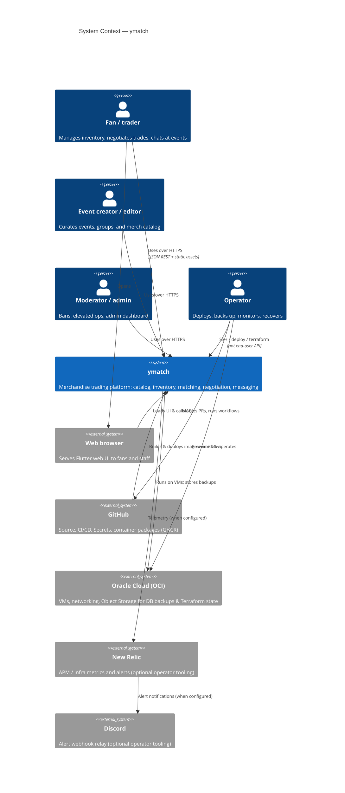
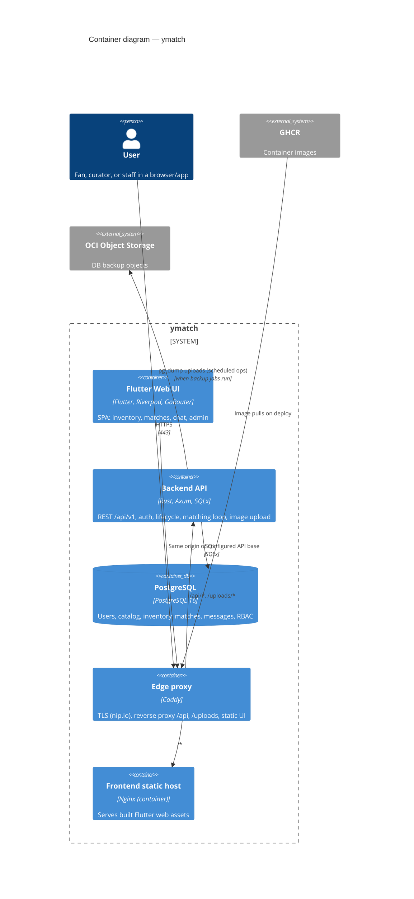

# 03 — Context and scope (C4)

This section uses the **C4 model** System Context (level 1) and Container
(level 2) views to show what is inside the ymatch boundary and what sits outside.

## System context (C4 level 1)

People and external systems that interact with **ymatch** as a whole.

### In scope

- Event / group / merch catalog
- Per-user inventory (HAVE / WANT / TRADE)
- Background matching within a group
- Trade negotiation state machine and inventory apply
- Match-scoped messaging and location hints
- Guest and account auth, RBAC
- Admin/moderator surfaces
- Image upload serving (local volume in OCI)

### Out of scope (external or not productized)

- Physical logistics of the meetup
- Production push providers (FCM/APNs) — notification module logs only
- Third-party payment rails
- Multi-region active-active failover

## Containers (C4 level 2)

Major deployable / runtime units **inside** the ymatch system boundary.

### Container responsibilities

| Container | Responsibility |
|-----------|----------------|
| **Flutter Web UI** | Presentation, client state, calls REST via `ApiClient` / protobuf JSON. |
| **Backend API** | Auth, RBAC checks, domain services, repositories, periodic matcher, image storage adapter. |
| **PostgreSQL** | System of record. |
| **Caddy** | Public HTTPS termination and path routing (prod/staging). |
| **Nginx (frontend container)** | Serves compiled Flutter assets only. |

Local development collapses edge routing: Flutter dev server (:8081) talks to API (:3000) with Postgres from `docker compose` (:5432). See [07 — Deployment](07-deployment.md).

## External interfaces (summary)

| Interface | Protocol | Notes |
|-----------|----------|--------|
| Browser ↔ API | HTTPS JSON REST | Base path `/api/v1`; see [API spec](../../reference/api_spec.md). |
| Browser ↔ images | HTTPS | `/uploads/*` via API static files when `IMAGE_STORAGE=local`. |
| API ↔ Postgres | TCP SQL | Connection string from env (`DATABASE_URL`). |
| CI ↔ VM | SSH + Docker | GitHub Actions deploy workflows. |
| Ops ↔ OCI | OCI API / Terraform | Infra and Object Storage; secrets never in git. |
