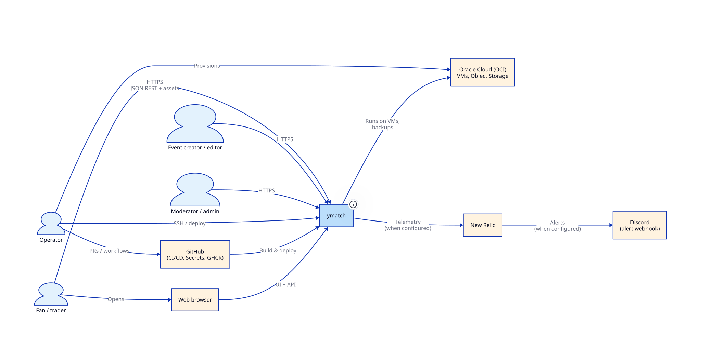

# 03 — Context and scope (C4)

This section uses the **C4 model System Context** (level 1) view: people and
external systems that interact with **ymatch** as a black box, plus what is in
or out of product scope.

Internal decomposition starts at **C4 level 2 (Containers)** in
[05 — Building blocks](05-building-blocks.md). How containers are placed on
machines is in [07 — Deployment](07-deployment.md).

C4 structural diagrams are authored in [D2](https://d2lang.com/) and committed
as SVG under [`diagrams/`](diagrams/) (GitHub does not reliably render Mermaid
C4). Sequences and simple flowcharts elsewhere use Mermaid.

## System context (C4 level 1)

Source: [`diagrams/03-system-context.d2`](diagrams/03-system-context.d2)

### In scope

- Event / group / merch catalog
- Per-user inventory (HAVE / WANT / TRADE)
- Background matching within a group
- Trade negotiation state machine and inventory apply
- Match-scoped messaging and location hints
- Guest and account auth, RBAC
- Admin/moderator surfaces
- Image upload serving (local volume in OCI)
- Background auto-match alerts via **Web Push + VAPID** (web/PWA clients; see [ADR 0015](../adr/0015-web-push-vapid-auto-match.md)) — implementation tracked in [#179](https://github.com/menonu/ymatch/issues/179); sender remains a safe no-op until VAPID + client subscription land

### Out of scope (external or not productized)

- Physical logistics of the meetup
- Native mobile push (FCM / APNs) and non-web clients for match alerts
- In-app notification center, email, or SMS match alerts
- Third-party payment rails
- Multi-region active-active failover

## External interfaces (summary)

| Interface | Protocol | Notes |
|-----------|----------|--------|
| Browser ↔ API | HTTPS JSON REST | Base path `/api/v1`; see [API spec](../../reference/api_spec.md). |
| Browser ↔ images | HTTPS | `/uploads/*` via API static files (`UPLOAD_DIR`). |
| API ↔ Postgres | TCP SQL | Connection string from env (`DATABASE_URL`). |
| API → browser push services | Web Push (HTTPS) | VAPID-authenticated; best-effort after match create/reopen ([ADR 0015](../adr/0015-web-push-vapid-auto-match.md)). |
| CI ↔ VM | SSH + Docker | GitHub Actions deploy workflows. |
| Ops ↔ OCI | OCI API / Terraform | Infra and Object Storage; secrets never in git. |

Container-level wiring (Caddy paths, compose services) is detailed in
[05 — Building blocks](05-building-blocks.md) and
[07 — Deployment](07-deployment.md).
