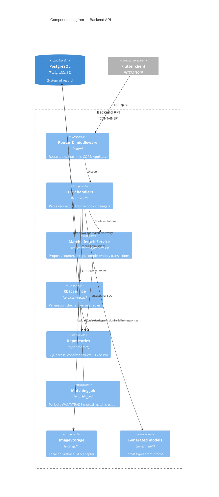
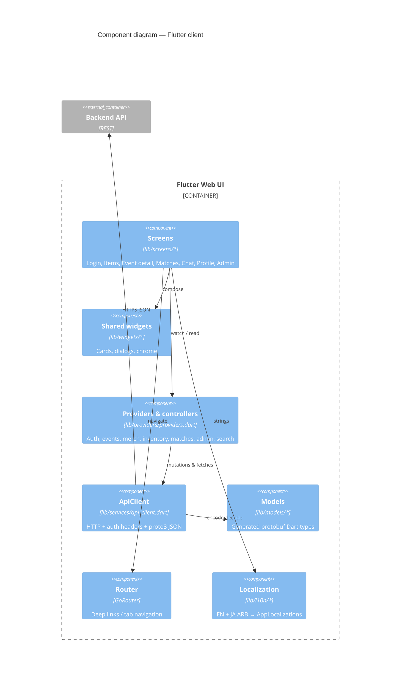
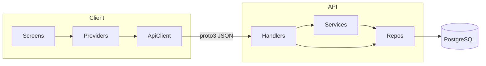

# 05 — Building block view (C4)

Structural decomposition inside the system. Uses **C4 Container** (recap) and
**C4 Component** views for the two largest codebases.

## Containers (recap)

See [03 — Context](03-context.md) for the full container diagram. Code maps to
containers as:

| Container | Primary codebase |
|-----------|------------------|
| Flutter Web UI | `frontend/` |
| Backend API | `backend/` |
| PostgreSQL | `backend/migrations/` (+ runtime data) |
| Caddy / Nginx | `Caddyfile.oci`, `frontend.Dockerfile.prod` |

## Backend components (C4 level 3)

### Backend module map

| Area | Path | Role |
|------|------|------|
| Entry | `main.rs`, `lib.rs` | Boot pool, spawn matcher, serve |
| Routes / state | `routes.rs` | `AppState`, middleware (incl. governor rate limit) |
| Handlers | `handlers/` | Auth, events, merch, inventory, matches, messages, admin, images, search, system |
| Match lifecycle | `services/match_lifecycle.rs` | Negotiation + inventory apply |
| RBAC | `services/rbac.rs`, `repositories/rbac.rs` | Permission model |
| Permissions catalog | `services/permission_catalog.rs` | Permission/role seed definitions |
| Repositories | `repositories/` | user, event, merch, group, inventory, match_, message, favorites, views, rbac |
| Matching | `matching.rs` | Background mutual-trade discovery |
| Notifications | `notifications.rs` | Log-only push stub |
| Storage | `storage/` | `ImageStorage` trait + local / Firebase |
| Errors | `error.rs` | `AppError` → HTTP |

### Repository list (SQL ownership)

| Repository | Domain tables (approx.) |
|------------|-------------------------|
| `UserRepository` | `users` (+ role derivation) |
| `EventRepository` | `events` |
| `MerchandiseRepository` | `merchandise` |
| `MerchandiseGroupRepository` | `merchandise_groups` |
| `InventoryRepository` | `inventory` |
| `MatchRepository` | `matches`, `match_items` |
| `MessageRepository` | `messages` |
| `EventFavoritesRepository` / `GroupFavoritesRepository` / `EventViewsRepository` | favorites & views |
| `RbacRepository` | `roles`, `permissions`, `role_permissions`, `user_roles` |

Exact columns: [DB schema reference](../../reference/db_schema.md).

## Frontend components (C4 level 3)

### Primary screens

| Screen | User-facing role |
|--------|------------------|
| `LoginScreen` | Guest start / restore / login |
| `HomeScreen` | **Items** tab — event list |
| `EventDetailScreen` | Merch + inventory for one event |
| `AddMerchScreen` | Create merch (RBAC-gated) |
| `TradeListScreen` | **Matches** tab — negotiate & complete |
| `ChatScreen` | Per-match messages / location |
| `ProfileScreen` | Account, how-to, system status |
| `AdminDashboardScreen` | Elevated admin/mod tools |

Identifiers and EN/JA labels: [UI components](../../reference/ui_components.md),
[UI specs](../../reference/ui_specs.md).

## Cross-container data

Shared **contract**: `proto/models.proto` → Rust `backend/src/generated` and
Dart `frontend/lib/models` via `scripts/proto-gen.sh`.
