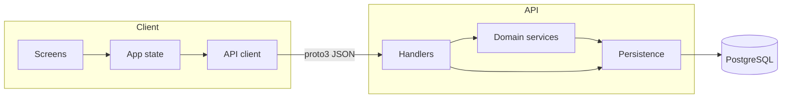

# 05 — Building block view (C4)

Structural decomposition **inside** the ymatch system boundary, following the
C4 hierarchy:

| C4 level | View | Where |
|----------|------|--------|
| 1 — System Context | Black-box system + people/external systems | [03 — Context](03-context.md) |
| **2 — Containers** | Deployable / runtime units | **this section** |
| **3 — Components** | Major **conceptual** modules inside the largest containers | **this section** |

This view describes **responsibilities and collaboration**, not a complete
source-tree inventory. File paths may appear in diagrams as orientation aids
only; they are not an exhaustive module list. Placement on hosts is
[07 — Deployment](07-deployment.md). Tables and columns live in
[DB schema](../../reference/db_schema.md); UI identifiers in
[UI components](../../reference/ui_components.md).

C4 diagrams: [D2](https://d2lang.com/) → SVG in [`diagrams/`](diagrams/).
Simple data-flow uses Mermaid below.

## Containers (C4 level 2)

Major deployable / runtime units inside the system boundary.


Source: [`diagrams/05-containers.d2`](diagrams/05-containers.d2)

> **Note on the SPA box:** In production the Flutter UI is **static assets**
> served by the Nginx container; JS runs in the **user’s browser**, not as a
> separate process next to Nginx. The “Flutter Web UI” box is a **logical**
> client module. Deployable peers are Caddy, Nginx, Backend API, and PostgreSQL
> (see also [07 — Deployment](07-deployment.md)).

### Container responsibilities

| Container | Responsibility |
|-----------|----------------|
| **Flutter Web UI** (logical) | Presentation, client state, calls the API over HTTPS JSON |
| **Nginx (frontend container)** | Serves the built web assets in staging/prod |
| **Backend API** | HTTP API, domain rules, matching job, image storage adapter |
| **PostgreSQL** | System of record |
| **Caddy** | Public HTTPS termination and path routing (staging/prod) |

Local development collapses edge routing: Flutter dev server talks to the API
with Postgres from Compose. See [07 — Deployment](07-deployment.md).

## Backend components (C4 level 3)

Conceptual modules inside the **Backend API** container (not a file listing).


Source: [`diagrams/05-backend-components.d2`](diagrams/05-backend-components.d2)

### Conceptual modules

| Module | Responsibility |
|--------|----------------|
| **HTTP edge** | Routing, middleware (e.g. rate limit), shared app state wiring |
| **HTTP handlers** | Parse requests, enforce entry gates, map results/errors (prefer no domain SQL) |
| **Access control** | Ban/active checks and RBAC permission decisions (privileged paths) |
| **Trade lifecycle** | Negotiation state machine and inventory apply (transactional) |
| **Domain persistence** | SQL ownership per domain (users, catalog, inventory, matches, messages, roles, …) |
| **Matching job** | Periodic discovery of mutual TRADE/WANT pairs within a group (raw SQL today) |
| **Image storage** | Pluggable store for uploaded merch photos (local volume or object store) |
| **Wire models** | Shared request/response shapes (protobuf-generated types) |
| **Notifications** | Outbound user alerts (currently a log-only stub; not drawn on the L3 diagram) |

Layering sketch (same idea as [04 — Solution strategy](04-solution-strategy.md)):

```
HTTP handlers  →  access control + trade lifecycle (+ other services)
               →  domain persistence
               →  PostgreSQL
```

Target layering for most product paths; remaining matching SQL exception
noted in [04](04-solution-strategy.md) (#497).

## Frontend components (C4 level 3)

Conceptual modules inside the **Flutter Web UI** (client-side; assets hosted by
Nginx in prod).


Source: [`diagrams/05-frontend-components.d2`](diagrams/05-frontend-components.d2)

### Conceptual modules

| Module | Responsibility |
|--------|----------------|
| **Screens / navigation** | User-facing surfaces and routing (login, items, event detail, matches, chat, profile, admin, …) |
| **Shared UI** | Reusable chrome, cards, dialogs |
| **App state** | Auth session, catalog/inventory/matches loads, controllers for mutations |
| **API client** | HTTPS JSON + protobuf encoding to the Backend API |
| **Localization** | EN / JA user-visible strings |

### Primary user surfaces (product)

| Surface | Role |
|---------|------|
| Login | Guest start / restore / account entry |
| Items (event list) | Browse and open events |
| Event detail | Merch catalog + personal inventory for one event |
| Matches | Negotiate, complete, and apply trades |
| Chat | Coordinate meetup / location for a match |
| Profile | Account, how-to, system status |
| Admin | Elevated moderation / catalog tools |

Code identifiers and EN/JA labels: [UI components](../../reference/ui_components.md),
[UI specs](../../reference/ui_specs.md).

## Cross-container data



Shared **contract**: protobuf models regenerated into backend and frontend
bindings (`scripts/proto-gen.sh`). Endpoint catalog:
[API spec](../../reference/api_spec.md).
