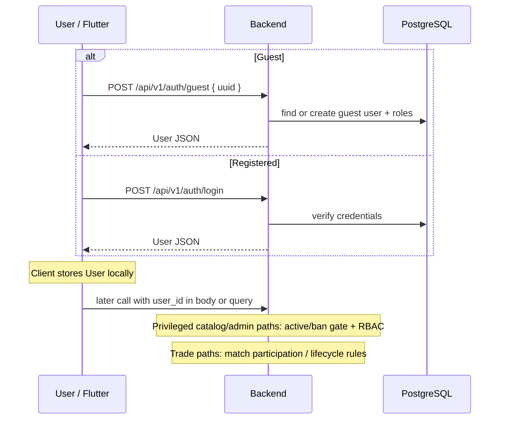
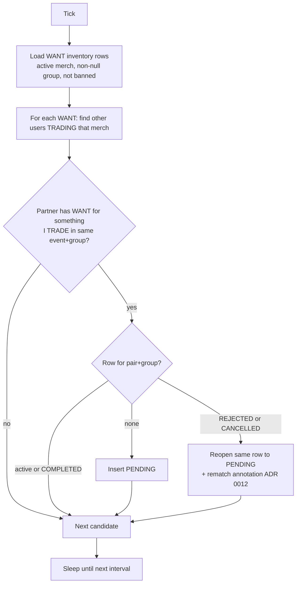
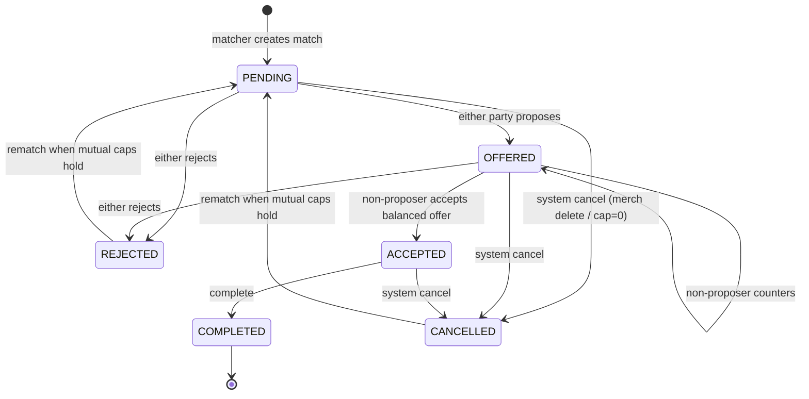
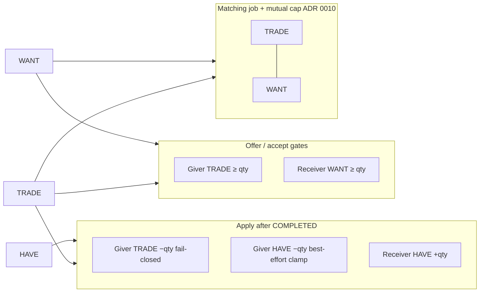
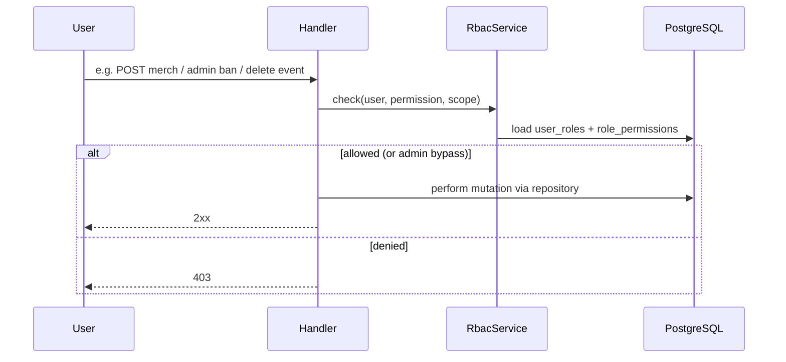

# 06 — Runtime view

Key runtime scenarios. State machines and permission matrices are defined in
ADRs/reference; this page shows how they execute end-to-end.

Runtime diagrams use **Mermaid** (sequence / flowchart / state). Structural C4
views live as D2→SVG in sections 03, 05, and 07.

## UC overview (product flows)

| ID | Flow | Primary actors |
|----|------|----------------|
| UC-01 | Manage inventory for an event (HAVE / WANT / TRADE) | User |
| UC-02 | System creates a PENDING match from complementary lists | Matching job |
| UC-03 | Negotiate (propose / counter / accept / reject) | Two matched users |
| UC-04 | Complete trade and apply inventory | Users + lifecycle service |
| UC-05 | Chat / share location to meet | Matched users |
| UC-06 | Curate event & merch (RBAC) | Creator / editor / staff |

## Auth and session

No bearer/JWT middleware. Login and guest endpoints return a `User`; the client
reuses that identity by sending `user_id` on later calls.



- Guest path minimizes signup friction for event-day use.
- `User.role` on the wire is **derived** from global `user_roles` at read time
  ([ADR 0006](../adr/0006-derive-user-role-from-user-roles.md)).
- Product wording “propose / counter” maps to offer/status lifecycle operations
  (not a separate status named “propose”).

## Matching job

Runs inside the API process on an interval (`MATCHING_INTERVAL_SECONDS`).



Matching creates or reopens **PENDING** opportunities. It does not move inventory.
It uses only **TRADE** (supply) and **WANT** (demand); **HAVE** is ignored
([inventory status semantics](#inventory-status-semantics)). Scope rules:
[ADR 0001](../adr/0001-match-scoped-to-item-group.md). Rematch after reject/cancel:
[ADR 0012](../adr/0012-rematch-after-reject-or-cancel.md).

## Trade negotiation and completion

State machine (simplified from [ADR 0002](../adr/0002-negotiation-state-machine.md)
and [ADR 0012](../adr/0012-rematch-after-reject-or-cancel.md)):



After `COMPLETED`, each party may **apply inventory** as a separate, idempotent
step (status stays `COMPLETED`; not a further state-machine transition). Deltas
and gates are summarized under [Inventory status semantics](#inventory-status-semantics)
below; full decisions in [ADR 0009](../adr/0009-apply-inventory-decrements-giver-have.md)
and [ADR 0014](../adr/0014-fail-closed-inventory-apply.md).

```mermaid
sequenceDiagram
  participant A as User A (Flutter)
  participant B as User B (Flutter)
  participant API as MatchLifecycleService
  participant DB as PostgreSQL

  Note over A,B: Match is PENDING (from matcher)
  A->>API: propose legs (absolute giver legs)
  API->>DB: BEGIN, validate WANT+TRADE, upsert match_items, status=OFFERED, offered_by=A, COMMIT
  B->>API: counter or accept
  alt Accept (B is non-proposer, balanced)
    API->>DB: re-check WANT+TRADE on full legs, status=ACCEPTED
    A->>API: complete
    API->>DB: status=COMPLETED
    A->>API: apply inventory (A side)
    API->>DB: TRADE fail-closed; HAVE best-effort; mark applied
    B->>API: apply inventory (B side)
  else Reject
    API->>DB: status=REJECTED
  end
```

Enforcement highlights:

- Only the **non-proposer** may accept; balance Σ qty each side gives equal and > 0.
- Legs are **absolute** (`giver_user_id`, merch, qty), not offerer-relative.
- Offer/accept re-check **receiver WANT** and **giver TRADE** (not HAVE) — see below.
- Apply is idempotent per user side once marked applied: the applied-flag
  check, inventory deltas, and conditional mark
  (`WHERE user{1,2}_inventory_applied_at IS NULL`) run under
  `SELECT … FOR UPDATE` on the match row (#492). Concurrent applies for
  the same user → one success, one `409 Conflict`; inventory deltas once.
  Clients: on `409`, refresh state and do not re-apply for more deltas; on
  ambiguous network failure, a single retry is safe.

## Inventory status semantics

Inventory rows are keyed by `(user_id, merch_id, status)` with
`status ∈ {HAVE, WANT, TRADE}` and a non-negative `quantity`. The three
statuses are **not interchangeable**: only some participate in matching and
trade capacity.

### What each status means

| Status | Product meaning | Required for trading? |
|--------|-----------------|------------------------|
| **`TRADE`** | Units the user is willing to put on the table (supply pool). | **Yes** — matching supply and give capacity. |
| **`WANT`** | Units the user wants from others (demand). | **Yes** — matching demand and receive-side offer caps. |
| **`HAVE`** | Optional bookkeeping for “I own this many” (physical possession). | **No** — convenience only; never a trade gate. |

Users may hold any combination of rows for the same merch (e.g. `HAVE=2`,
`TRADE=1`, `WANT=0`). Missing rows count as quantity **0**.

### Where each status is used



| Concern | TRADE | WANT | HAVE |
|---------|:-----:|:----:|:----:|
| Matcher creates/reopens PENDING | supply | demand | — |
| Mutual capacity cancel ([ADR 0010](../adr/0010-inventory-mutual-capacity-invalidation.md)) | yes | yes | — |
| Offer/accept: cap leg by **receiver** demand | — | yes | — |
| Offer/accept: require **giver** supply | yes | — | — |
| Apply: giver decrement | fail-closed | — | best-effort clamp |
| Apply: receiver increment | — | — | yes |

### Negotiation quantity gates

For each positive leg `(giver, merch, qty)` (quantities aggregated per
`(giver, merch)` so split rows cannot bypass caps):

1. **Receiver WANT** — the non-giver’s `WANT` for that merch must be `≥ qty`
   ([#294](https://github.com/menonu/ymatch/issues/294) / #297).
2. **Giver TRADE** — the giver’s `TRADE` for that merch must be `≥ qty`
   ([#493](https://github.com/menonu/ymatch/issues/493) / [ADR 0014](../adr/0014-fail-closed-inventory-apply.md)).
3. **HAVE is not checked** at offer or accept. A user can negotiate and accept
   with no HAVE row (or `HAVE < qty`).

Accept re-runs both gates on the **full accumulated** leg set so mid-negotiation
WANT or TRADE changes still fail closed with **400**.

### Apply deltas (after COMPLETED)

Each participant applies independently (idempotent per user side). Per absolute
leg, for the **requesting** user ([ADR 0009](../adr/0009-apply-inventory-decrements-giver-have.md)):

| Role | Default | `skipHaveDecrement: true` |
|------|---------|---------------------------|
| Giver | `TRADE −qty` (fail-closed), `HAVE −qty` (clamp ≥ 0) | `TRADE −qty` only |
| Receiver | `HAVE +qty` | same (flag ignored) |

- **TRADE** insufficient → **400**, no inventory mutation for that apply
  transaction ([ADR 0014](../adr/0014-fail-closed-inventory-apply.md)).
- **HAVE** short or missing → clamp to 0; apply still succeeds. HAVE may drift
  from physical reality if the user never tracked it; that is accepted for a
  convenience field.
- Successful TRADE decrements also re-evaluate mutual capacity for the user’s
  other active matches ([ADR 0010](../adr/0010-inventory-mutual-capacity-invalidation.md)).

### User-driven inventory edits

Users edit inventory on event detail / items UI →
`UserInventoryNotifier` / inventory API → `InventoryRepository` (and lifecycle
upsert path for WANT/TRADE so capacity invalidation runs in the same
transaction).

## Messaging

After a match exists, users open `ChatScreen` → messages API →
`MessageRepository`. Location payloads are message content, not a separate geo
service.

## Privileged operations



Catalog: [permissions reference](../../reference/permissions.md),
[ADR 0004](../adr/0004-rbac-permission-model.md),
[ADR 0005](../adr/0005-merch-create-permission.md).
