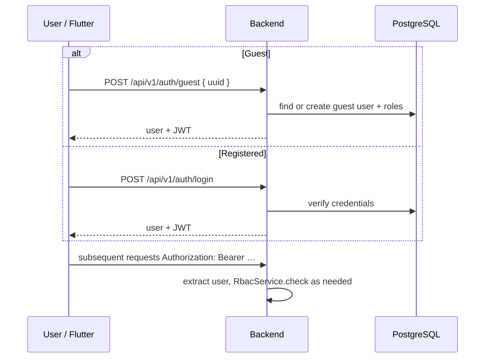
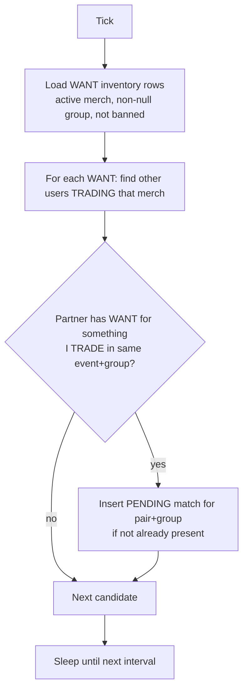
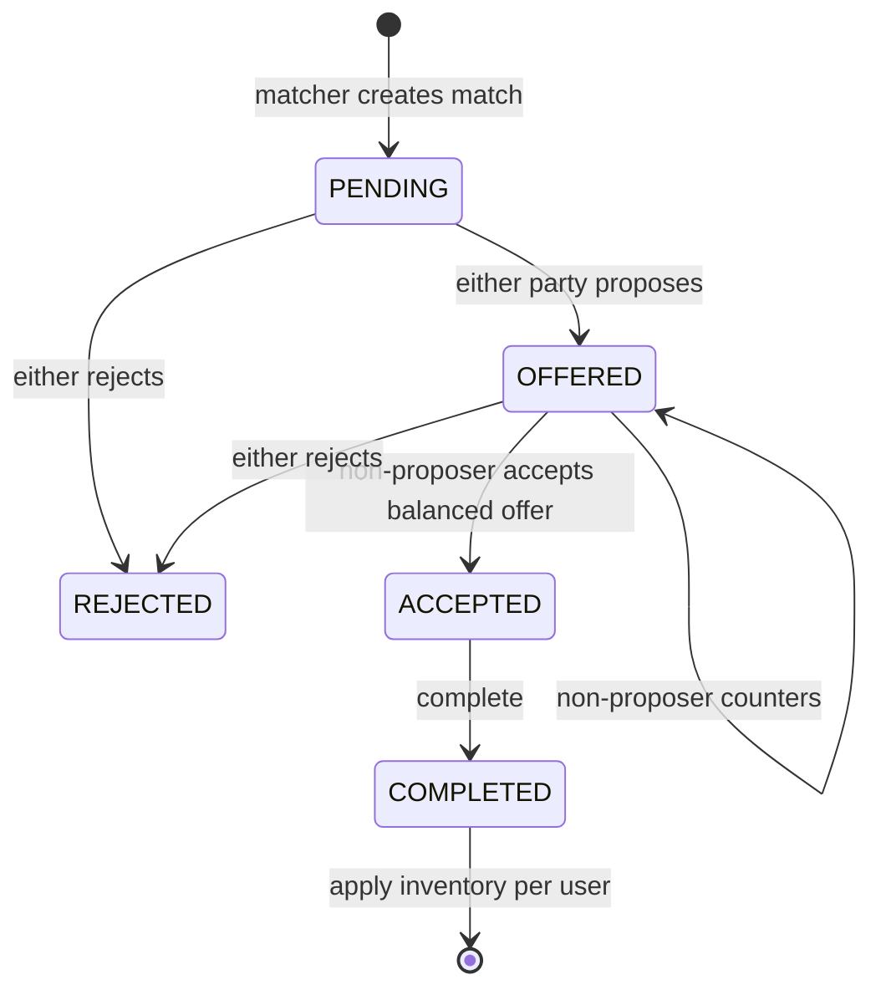
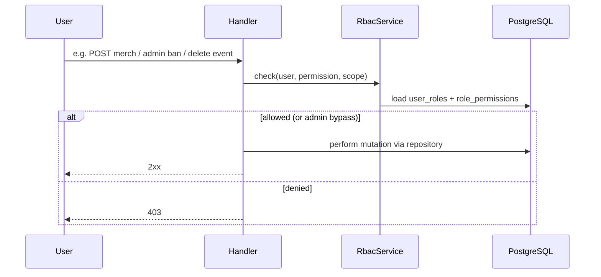

# 06 — Runtime view

Key runtime scenarios. State machines and permission matrices are defined in
ADRs/reference; this page shows how they execute end-to-end.

Runtime diagrams use **Mermaid** (sequence / flowchart / state). Structural C4
views live as D2→SVG in sections 03, 05, and 07.

## UC overview (product flows)

| ID | Flow | Primary actors |
|----|------|----------------|
| UC-01 | Manage inventory for an event (HAVE / WANT / TRADE) | User |
| UC-02 | System creates a PENDING match from complementary lists | Matching job |
| UC-03 | Negotiate (propose / counter / accept / reject) | Two matched users |
| UC-04 | Complete trade and apply inventory | Users + lifecycle service |
| UC-05 | Chat / share location to meet | Matched users |
| UC-06 | Curate event & merch (RBAC) | Creator / editor / staff |

## Auth and session



- Guest path minimizes signup friction for event-day use.
- `User.role` on the wire is **derived** from global `user_roles` at read time
  ([ADR 0006](../adr/0006-derive-user-role-from-user-roles.md)).

## Matching job

Runs inside the API process on an interval (`MATCHING_INTERVAL_SECONDS`).



Matching only creates **PENDING** opportunities. It does not move inventory.
Scope rules: [ADR 0001](../adr/0001-match-scoped-to-item-group.md).

## Trade negotiation and completion

State machine (simplified from [ADR 0002](../adr/0002-negotiation-state-machine.md)):



```mermaid
sequenceDiagram
  participant A as User A (Flutter)
  participant B as User B (Flutter)
  participant API as MatchLifecycleService
  participant DB as PostgreSQL

  Note over A,B: Match is PENDING (from matcher)
  A->>API: propose legs (absolute giver legs)
  API->>DB: BEGIN; validate; upsert match_items; status=OFFERED; offered_by=A; COMMIT
  B->>API: counter or accept
  alt Accept (B is non-proposer, balanced)
    API->>DB: status=ACCEPTED
    A->>API: complete
    API->>DB: status=COMPLETED
    A->>API: apply inventory (A's side)
    API->>DB: adjust HAVE/TRADE/WANT; mark applied
    B->>API: apply inventory (B's side)
  else Reject
    API->>DB: status=REJECTED
  end
```

Enforcement highlights:

- Only the **non-proposer** may accept; balance Σ qty each side gives equal and > 0.
- Legs are **absolute** (`giver_user_id`, merch, qty), not offerer-relative.
- Apply is idempotent per user side once marked applied.

## Inventory update (user-driven)

Users edit inventory on event detail / items UI →
`UserInventoryNotifier` / inventory API → `InventoryRepository`.

Statuses used in product logic:

| Status | Meaning |
|--------|---------|
| `HAVE` | Owned (including post-trade storage) |
| `WANT` | Desired; drives matching as demand |
| `TRADE` | Offered into the matching pool as supply |

## Messaging

After a match exists, users open `ChatScreen` → messages API →
`MessageRepository`. Location payloads are message content, not a separate geo
service.

## Privileged operations



Catalog: [permissions reference](../../reference/permissions.md),
[ADR 0004](../adr/0004-rbac-permission-model.md),
[ADR 0005](../adr/0005-merch-create-permission.md).
