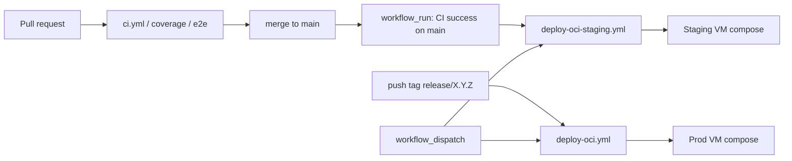

# 07 — Deployment view (C4)

How the containers are placed on infrastructure for **local development**,
**staging**, and **production**. Operational steps live in How-To guides; this
section is the map.

C4 deployment maps: [D2](https://d2lang.com/) → SVG in [`diagrams/`](diagrams/).
CI sketch uses Mermaid.

## Production / staging (C4 deployment)

Staging and production use the **same** `docker-compose.oci.yml` on separate
OCI Ampere A1 VMs (see issue #209). They differ by host, secrets, and sizing —
not by architecture.


Source: [`diagrams/07-deployment-oci.d2`](diagrams/07-deployment-oci.d2)

### Environment matrix

| | Production | Staging |
|--|------------|---------|
| Compose file | `docker-compose.oci.yml` | same |
| Workflow | `deploy-oci.yml` | `deploy-oci-staging.yml` |
| Typical size | 2 OCPU / 12 GB | 1 OCPU / 4 GB |
| Public URL | `https://<prod_ip>.nip.io` | `https://<staging_ip>.nip.io` |
| Data | Production DB volume | Separate DB volume |

### Edge routing

```
Internet → Caddy :443
             ├─ /api/*     → ymatch_backend :3000
             ├─ /uploads/* → ymatch_backend (static uploads volume)
             └─ /*         → ymatch_frontend (Nginx)
```

### How-to and recovery

| Task | Doc |
|------|-----|
| First-time / full deploy | [OCI deployment](../../how_to/oci_deployment.md) |
| Terraform secrets | [terraform_apply](../../how_to/terraform_apply.md) |
| API keys / SSH recovery | [oci_credentials](../../how_to/oci_credentials.md) |
| Monitoring | [monitoring_setup](../../how_to/monitoring_setup.md) |
| VM loss / key loss lessons | [disaster_recovery](../disaster_recovery.md) |

## Local development (C4 deployment)


Source: [`diagrams/07-deployment-local.d2`](diagrams/07-deployment-local.d2)

| Service | Port (default) |
|---------|----------------|
| PostgreSQL | 5432 |
| Backend API | 3000 |
| Flutter web | 8081 |
| pgAdmin | 5050 |

Tutorial: [Developer quickstart](../../tutorials/developer_quickstart.md).

## E2E test stack

Wire-contract e2e uses `docker-compose.e2e.yml` (isolated DB/API) driven by
Flutter tests tagged `e2e`. Guide: [e2e_tests](../../how_to/e2e_tests.md).

## CI/CD sketch

Staging and production use **different triggers** (identical Compose stack shape):



| Environment | Workflow | When it runs |
|-------------|----------|--------------|
| Staging | `deploy-oci-staging.yml` | After successful **CI** on `main` (`workflow_run`), or manual `workflow_dispatch` |
| Production | `deploy-oci.yml` | Push of tag `release/X.Y.Z`, or manual `workflow_dispatch` — **not** every merge to `main` |

Secrets (DB passwords, SSH keys, hosts, New Relic, Discord) live in **GitHub
Secrets** only — never in the repo ([security.md](../security.md)).

## Infrastructure as code

| Module | Purpose |
|--------|---------|
| `terraform/oci` | VCN, VMs, networking for app hosts |
| `terraform/newrelic` | Alerting / monitoring resources |

State and credentials: Object Storage backend + gitignored `terraform.tfvars` /
`.env` — see [terraform_apply](../../how_to/terraform_apply.md).
