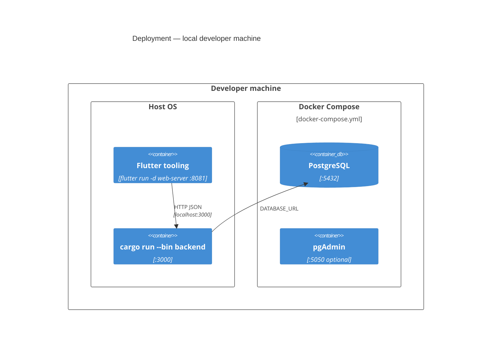
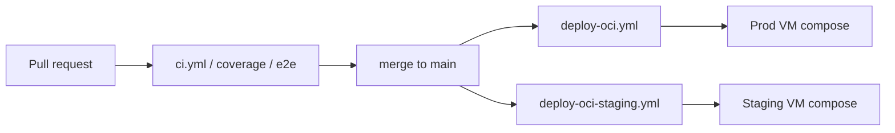

# 07 — Deployment view (C4)

How the containers are placed on infrastructure for **local development**,
**staging**, and **production**. Operational steps live in How-To guides; this
section is the map.

## Production / staging (C4 deployment)

Staging and production use the **same** `docker-compose.oci.yml` on separate
OCI Ampere A1 VMs (see issue #209). They differ by host, secrets, and sizing —
not by architecture.

```mermaid
C4Deployment
title Deployment — OCI staging / production (per environment)

Deployment_Node(internet, "Internet", "") {
    Deployment_Node(user_device, "User device", "Browser") {
        Container(browser, "Browser", "Flutter web client session")
    }
}

Deployment_Node(oci, "OCI tenancy", "Always Free region e.g. ap-tokyo-1") {
    Deployment_Node(vm, "Compute VM", "Ampere A1 — prod or staging shape") {
        Deployment_Node(docker, "Docker Engine", "compose project") {
            Container(caddy, "Caddy", "TLS + reverse proxy :80/:443")
            Container(fe, "ymatch_frontend", "Nginx + Flutter build")
            Container(api, "ymatch_backend", "Rust API :3000, IMAGE_STORAGE=local")
            ContainerDb(db, "ymatch_db", "PostgreSQL 16")
            Container(uploads, "uploads volume", "Local image files")
            Container(pgdata, "pg_data volume", "Database files")
        }
    }

    Deployment_Node(os, "Object Storage", "Bucket") {
        ContainerDb(backups, "DB backups + tfstate", "Objects")
    }
}

Deployment_Node(gh, "GitHub", "") {
    Container(gha, "Actions", "deploy-oci.yml / deploy-oci-staging.yml")
    Container(ghcr, "GHCR", "Mirrored base images / builds")
}

Rel(browser, caddy, "HTTPS", "https://<ip>.nip.io")
Rel(caddy, fe, "/*")
Rel(caddy, api, "/api/*, /uploads/*")
Rel(api, db, "SQL")
Rel(api, uploads, "read/write")
Rel(db, pgdata, "files")
Rel(gha, vm, "SSH deploy / compose up")
Rel(vm, ghcr, "Pull images")
Rel(vm, backups, "pg_dump upload (backup jobs)")
```

### Environment matrix

| | Production | Staging |
|--|------------|---------|
| Compose file | `docker-compose.oci.yml` | same |
| Workflow | `deploy-oci.yml` | `deploy-oci-staging.yml` |
| Typical size | 2 OCPU / 12 GB | 1 OCPU / 4 GB |
| Public URL | `https://<prod_ip>.nip.io` | `https://<staging_ip>.nip.io` |
| Data | Production DB volume | Separate DB volume |

### Edge routing

```
Internet → Caddy :443
             ├─ /api/*     → ymatch_backend :3000
             ├─ /uploads/* → ymatch_backend (static uploads volume)
             └─ /*         → ymatch_frontend (Nginx)
```

### How-to and recovery

| Task | Doc |
|------|-----|
| First-time / full deploy | [OCI deployment](../../how_to/oci_deployment.md) |
| Terraform secrets | [terraform_apply](../../how_to/terraform_apply.md) |
| API keys / SSH recovery | [oci_credentials](../../how_to/oci_credentials.md) |
| Monitoring | [monitoring_setup](../../how_to/monitoring_setup.md) |
| VM loss / key loss lessons | [disaster_recovery](../disaster_recovery.md) |

## Local development (C4 deployment)



| Service | Port (default) |
|---------|----------------|
| PostgreSQL | 5432 |
| Backend API | 3000 |
| Flutter web | 8081 |
| pgAdmin | 5050 |

Tutorial: [Developer quickstart](../../tutorials/developer_quickstart.md).

## E2E test stack

Wire-contract e2e uses `docker-compose.e2e.yml` (isolated DB/API) driven by
Flutter tests tagged `e2e`. Guide: [e2e_tests](../../how_to/e2e_tests.md).

## CI/CD sketch



Secrets (DB passwords, SSH keys, hosts, New Relic, Discord) live in **GitHub
Secrets** only — never in the repo ([security.md](../security.md)).

## Infrastructure as code

| Module | Purpose |
|--------|---------|
| `terraform/oci` | VCN, VMs, networking for app hosts |
| `terraform/newrelic` | Alerting / monitoring resources |

State and credentials: Object Storage backend + gitignored `terraform.tfvars` /
`.env` — see [terraform_apply](../../how_to/terraform_apply.md).
