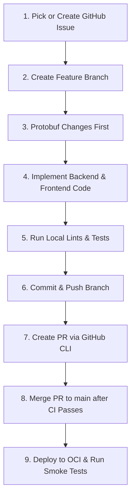

# Development Workflow Guide

This guide describes the step-by-step process for making code changes, running quality checks, raising pull requests, and deploying updates in the `ymatch` repository.

---

## Workflow Overview



---

## Step 1: Track and Choose a Task
All tasks and bug fixes must be associated with a GitHub Issue.
- Use the GitHub CLI to view active issues or create a new one:
  ```bash
  gh issue list
  gh issue create --title "feat: describe your feature" --body "Details..."
  ```

---

## Step 2: Create a Feature Branch
`ymatch` follows **Trunk-Based Development**. All work is performed in short-lived feature branches branching from `main`. **Never commit or push directly to `main`**.

1. Ensure your local `main` branch is up to date:
   ```bash
   git checkout main
   git pull origin main
   ```
2. Create and switch to a descriptive branch name (e.g., `feat/xxx` or `fix/xxx`):
   ```bash
   git checkout -b feat/add-new-feature
   ```

---

## Step 3: Protobuf Changes First (If applicable)
If your task changes the API payload structure or shared data models:
1. Edit the Protobuf definitions in [proto/models.proto](../../proto/models.proto).
2. Generate the updated Rust and Dart code:
   ```bash
   # Run the generation script (from root or scripts/ folder)
   ./scripts/generate_protos.sh
   ```
3. Verify that the generated code is updated in:
   - [backend/src/generated/ymatch.rs](../../backend/src/generated/ymatch.rs)
   - Frontend protobuf-generated files under `frontend/lib/generated/`.

---

## Step 4: Implement Code Changes
Implement your changes in the [backend/](../../backend) (Rust) and/or [frontend/](../../frontend) (Flutter) codebases.
- Maintain documentation integrity: do not delete existing docstrings or comments unless they are outdated or explicitly requested.

---

## Step 5: Run Local Lints and Tests
Your branch must pass all local checks before you push it to GitHub.

### 1. Build and Run Code Checks
- **Rust Backend**:
  ```bash
  cd backend
  cargo fmt -- --check
  cargo clippy -- -D warnings
  ```
- **Flutter Frontend**:
  ```bash
  cd frontend
  dart format --output=none --set-exit-if-changed .
  flutter analyze
  ```
  Prefer formatting only intentionally edited files (or a dedicated format
  commit). CI still requires the whole `frontend/` tree to be `dart format`-clean.

### 2. Run Test Suites
Ensure all tests pass. If you've modified the database structure, make sure database migrations are included.
- Run both frontend and backend tests:
  ```bash
  task test
  ```

---

## Step 6: Commit and Push Changes
Commit your changes with clear, descriptive commit messages:
```bash
git add .
git commit -m "feat: implement notifications for matched trades"
git push origin feat/add-new-feature
```

---

## Step 7: Create a Pull Request
Use the GitHub CLI to create a Pull Request against the `main` branch:
```bash
gh pr create --title "feat: implement notifications for matched trades" --body "Closes #<issue_number>. Description of changes..."
```
This triggers the CI pipeline (`.github/workflows/ci.yml`) to build and test your changes automatically.

PR CI intentionally stays light: **backend coverage**, **frontend coverage**, and **frontend wire e2e** run **post-merge on `main`** only (plus manual `workflow_dispatch`). That is the #279 cycle-time trade-off — a regression can surface after merge and need a follow-up fix. For high-risk PRs, run those checks **before** merge using the steps below.

---

## Step 7a: Optional pre-merge E2E and coverage (risky PRs)

Use this path when a failure on `main` would be expensive to unwind. These workflows are **not** required on every PR.

### When to run

Trigger the relevant workflow(s) if the PR touches any of:

| Category | Examples | Prefer |
|----------|----------|--------|
| **Proto / wire contract** | `proto/**`, generated Rust/Dart bindings, `toProto3Json` / offer-trade request bodies | Frontend E2E (`ci-e2e.yml`) |
| **Match / trade lifecycle** | match state machine, offer/accept/apply, matcher job | Frontend E2E; backend coverage if guards change |
| **Migrations / schema** | `backend/migrations/**`, SQL that integration tests exercise | Backend coverage (**70% floor / report**; PR `ci.yml` already runs DB tests) |
| **AuthZ / RBAC matrix** | permissions, role checks, admin/moderator paths | Backend coverage; frontend coverage if UI gates change |
| **Coverage-sensitive refactors** | large deletes, test moves, filtering scripts | Matching coverage workflow(s) |

Skip for docs-only, pure CSS/layout, or small non-contract changes — post-merge runs on `main` are enough.

### Exact commands

Push the PR branch first, then dispatch against that ref (workflow file name or display name both work with `gh`):

```bash
# From the repo root; BRANCH is the PR head branch (not main)
BRANCH="$(git branch --show-current)"

# Frontend wire E2E (docker-compose.e2e + Flutter e2e suite)
gh workflow run ci-e2e.yml --ref "$BRANCH"

# Backend line coverage (cargo-llvm-cov, 70% gate)
gh workflow run coverage.yml --ref "$BRANCH"

# Frontend line coverage (filtered LCOV, 68% gate)
gh workflow run coverage-frontend.yml --ref "$BRANCH"
```

Watch a **specific** workflow run and open its URL (pin the id so concurrent E2E/coverage dispatches do not mix):

```bash
# Latest run for this branch of a given workflow
RUN_ID="$(gh run list --workflow=ci-e2e.yml --branch "$BRANCH" --limit 1 --json databaseId -q '.[0].databaseId')"
gh run watch "$RUN_ID"    # optional: follow that run interactively
gh run view "$RUN_ID" --web   # open in browser
```

You can also start runs from the GitHub UI: **Actions** → workflow name → **Run workflow** → choose the PR branch.

Local alternatives (no GitHub minutes): [e2e_tests.md](./e2e_tests.md) (`task e2e:up` / `e2e:test` / `e2e:down`) and [Developer Quickstart — Coverage](../tutorials/developer_quickstart.md#coverage-reports) (`task backend:coverage` / `task frontend:coverage`). CI dispatch still matches production gates and is preferred when validating the same environment as `main`.

### Attach results on the PR

After the run finishes, paste a short note (and the run link) into the PR description or a comment:

```bash
# Example: print a markdown line for the latest E2E run on this branch
gh run list --workflow=ci-e2e.yml --branch "$BRANCH" --limit 1 \
  --json databaseId,conclusion,url,displayTitle \
  --jq '.[0] | "- Pre-merge E2E: \(.conclusion) — \(.url)"'
```

Suggested PR comment body:

```markdown
### Pre-merge heavy checks (#279 / #456)

- Frontend E2E: <url> — success
- Backend coverage: <url> — success
- Frontend coverage: <url> — n/a (not needed for this PR)
```

Reviewers can treat green pre-merge runs as extra confidence; they still do **not** replace required `ci.yml` checks. Discord alerts for E2E/coverage failures apply only to `main` (see [monitoring setup §4b](./monitoring_setup.md#4b-post-merge-e2e--coverage-failure-alerts-281)).

---

## Step 7b: Review the Pull Request

After the PR exists (and preferably after CI is green), run a structured review:

- Prefer `/pr-review <PR>` (project skill under [`.claude/skills/pr-review/`](../../.claude/skills/pr-review/)).
- Otherwise follow the [PR Review Guide](./pr_review.md): gather PR + issue + diff, evaluate correctness / security / design, and post a comment in the standard format with severities `[critical]` / `[major]` / `[minor]` / `[nit]`.
- For **risky** categories (proto, lifecycle, migrations, authz — Step 7a), confirm the author either ran pre-merge E2E/coverage or explained why post-merge on `main` is enough.

Address critical and major findings (or explain them), then re-run the review. Do not merge from the agent — see the next step.

---

## Step 8: Merge to `main`

> **Human-only step.** The merge itself is performed by a human, not by an AI agent or automation.

- **Do not** run `gh pr merge` (or any equivalent command) unless the user has given an **explicit, in-conversation instruction** authorizing the merge for that specific PR.
- A human merges the PR once the CI pipeline passes and any requested reviews are completed.
- The OCI deployment workflow is automatically triggered upon merging to `main`. The trigger (the merge) is gated by human action or explicit user approval — never by the agent on its own.

---

## Step 9: Deploy and Smoke Test

### Redeploying Services manually (on OCI VM if needed)
If you need to redeploy specific components directly on the OCI VM:
```bash
# SSH to the production VM
ssh ubuntu@<VM_PUBLIC_IP>

# Run redployment scripts
./scripts/oci_redeploy_backend.sh
./scripts/oci_redeploy_frontend.sh
```

### Run Smoke Tests
Always execute the smoke test script immediately after any backend deployment to verify production health:
```bash
./scripts/smoke_test.sh
```
