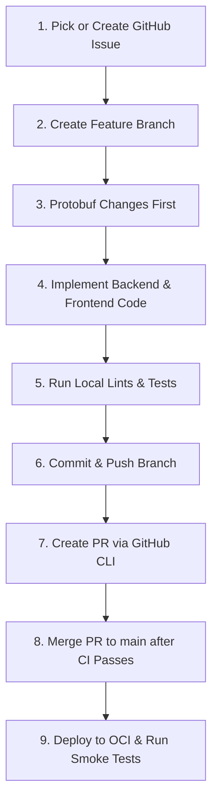

# Development Workflow Guide

This guide describes the step-by-step process for making code changes, running quality checks, raising pull requests, and deploying updates in the `ymatch` repository.

---

## Workflow Overview



---

## Step 1: Track and Choose a Task
All tasks and bug fixes must be associated with a GitHub Issue.
- Use the GitHub CLI to view active issues or create a new one:
  ```bash
  gh issue list
  gh issue create --title "feat: describe your feature" --body "Details..."
  ```

---

## Step 2: Create a Feature Branch
`ymatch` follows **Trunk-Based Development**. All work is performed in short-lived feature branches branching from `main`. **Never commit or push directly to `main`**.

1. Ensure your local `main` branch is up to date:
   ```bash
   git checkout main
   git pull origin main
   ```
2. Create and switch to a descriptive branch name (e.g., `feat/xxx` or `fix/xxx`):
   ```bash
   git checkout -b feat/add-new-feature
   ```

---

## Step 3: Protobuf Changes First (If applicable)
If your task changes the API payload structure or shared data models:
1. Edit the Protobuf definitions in [proto/models.proto](file:///home/menonu/ws/ymatch/proto/models.proto).
2. Generate the updated Rust and Dart code:
   ```bash
   # Run the generation script (from root or scripts/ folder)
   ./scripts/generate_protos.sh
   ```
3. Verify that the generated code is updated in:
   - [backend/src/generated/ymatch.rs](file:///home/menonu/ws/ymatch/backend/src/generated/ymatch.rs)
   - Frontend protobuf-generated files under `frontend/lib/generated/`.

---

## Step 4: Implement Code Changes
Implement your changes in the [backend/](file:///home/menonu/ws/ymatch/backend) (Rust) and/or [frontend/](file:///home/menonu/ws/ymatch/frontend) (Flutter) codebases.
- Maintain documentation integrity: do not delete existing docstrings or comments unless they are outdated or explicitly requested.

---

## Step 5: Run Local Lints and Tests
Your branch must pass all local checks before you push it to GitHub.

### 1. Build and Run Code Checks
- **Rust Backend**:
  ```bash
  cd backend
  cargo fmt -- --check
  cargo clippy -- -D warnings
  ```
- **Flutter Frontend**:
  ```bash
  cd frontend
  flutter analyze
  ```

### 2. Run Test Suites
Ensure all tests pass. If you've modified the database structure, make sure database migrations are included.
- Run both frontend and backend tests:
  ```bash
  task test
  ```

---

## Step 6: Commit and Push Changes
Commit your changes with clear, descriptive commit messages:
```bash
git add .
git commit -m "feat: implement notifications for matched trades"
git push origin feat/add-new-feature
```

---

## Step 7: Create a Pull Request
Use the GitHub CLI to create a Pull Request against the `main` branch:
```bash
gh pr create --title "feat: implement notifications for matched trades" --body "Closes #<issue_number>. Description of changes..."
```
This triggers the CI pipeline (`.github/workflows/ci.yml`) to build and test your changes automatically.

---

## Step 8: Merge to `main`
Once the CI pipeline passes and any requested reviews are completed, merge the PR. The OCI deployment workflow is automatically triggered upon merging to `main`.

---

## Step 9: Deploy and Smoke Test

### Redeploying Services manually (on OCI VM if needed)
If you need to redeploy specific components directly on the OCI VM:
```bash
# SSH to the production VM
ssh ubuntu@<VM_PUBLIC_IP>

# Run redployment scripts
./scripts/oci_redeploy_backend.sh
./scripts/oci_redeploy_frontend.sh
```

### Run Smoke Tests
Always execute the smoke test script immediately after any backend deployment to verify production health:
```bash
./scripts/smoke_test.sh
```
