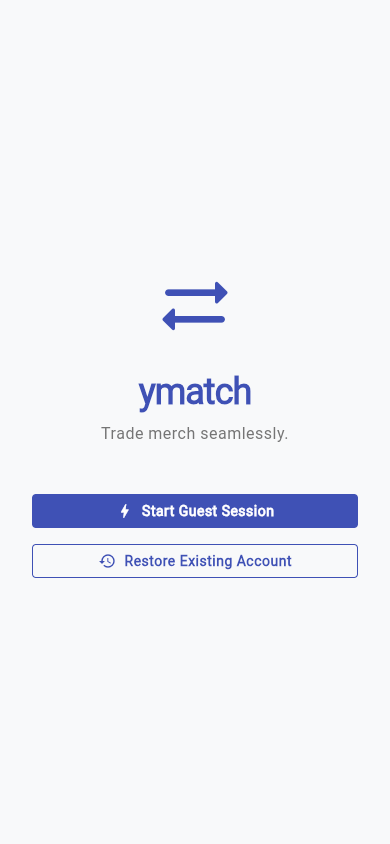

# YMatch - Admin Debug Tools Walkthrough

This document highlights the recently added features and tools designed to accelerate development, testing, and debugging of the YMatch platform.

## 1. Global & Granular Search
The search functionality has been revamped to allow for distinct, rapid filtering directly within the related contexts.

- **Home Screen (Events):** The global search bar on the home screen now instantly filters the list of events locally.
- **Event Details (Items):** Inside an event, a dedicated search bar has been added to the top app bar to quickly filter items by name, complementing the existing status filters (HAVE/WANT).

## 2. Admin Dashboard - Debug Tools
All developer tools have been migrated from the Profile screen to a dedicated **Debug** tab within the **Admin Dashboard**. This cleans up the user-facing profile while giving developers a centralized control panel.

### Developer / Debug Tools
- **Generate Test Event (50 items in 5 tabs):** Instantly creates a massive test event to verify UI scrolling, tab behavior, and performance under load.
- **Open New Guest Session in Browser:** This button uses a unique `dev_user` URL parameter to launch a fresh, isolated guest session in a new browser tab. It's incredibly useful for testing multi-user interactions (like trading) without needing multiple devices or incognito windows.

### State Simulation
To test the core matching engine without waiting for organic user behavior:
- **Force Trigger Matching Algorithm:** Manually invokes the background Rust matching process across the entire database.
- **Simulate Incoming Match Request:** Automatically generates a mock user, gives them an item you `WANT`, and makes them `WANT` an item you have for `TRADE`. This guarantees a match is formed for your current account, making it easy to test notifications and trade UI.

### Data Generation
Fine-grained controls to construct precise testing scenarios:
- **Create Empty Event:** Scaffolds a new event with zero items.
- **Add Items (5 or 10):** Input a Target Event ID and instantly inject mock merchandise into it.
- **Generate Mock Users & Inventory:** Input a Target Event ID and create 5 to 10 mock users who randomly assign `HAVE` and `WANT` statuses to the items within that event.

### Danger Zone (Nuke & Reset)
- **Reset My Data:** Clears out only the current user's inventory and matches, leaving the rest of the database intact.
- **Nuke & Seed DB:** Completely wipes all events, users, items, and matches from the database, then automatically seeds a clean "Demo Event" with a few standard items to start fresh.

---
*Note: These tools interact directly with backend endpoints (`/api/v1/debug/*`) and should only be available in development/staging environments.*
